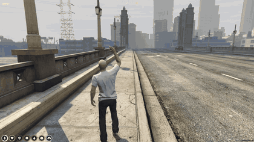
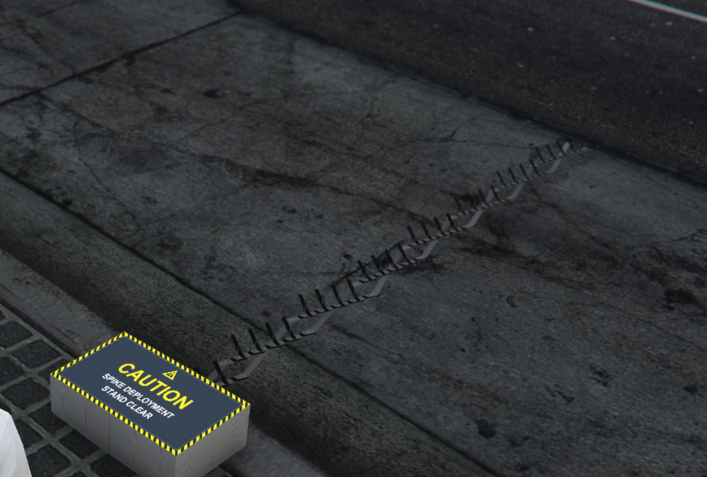
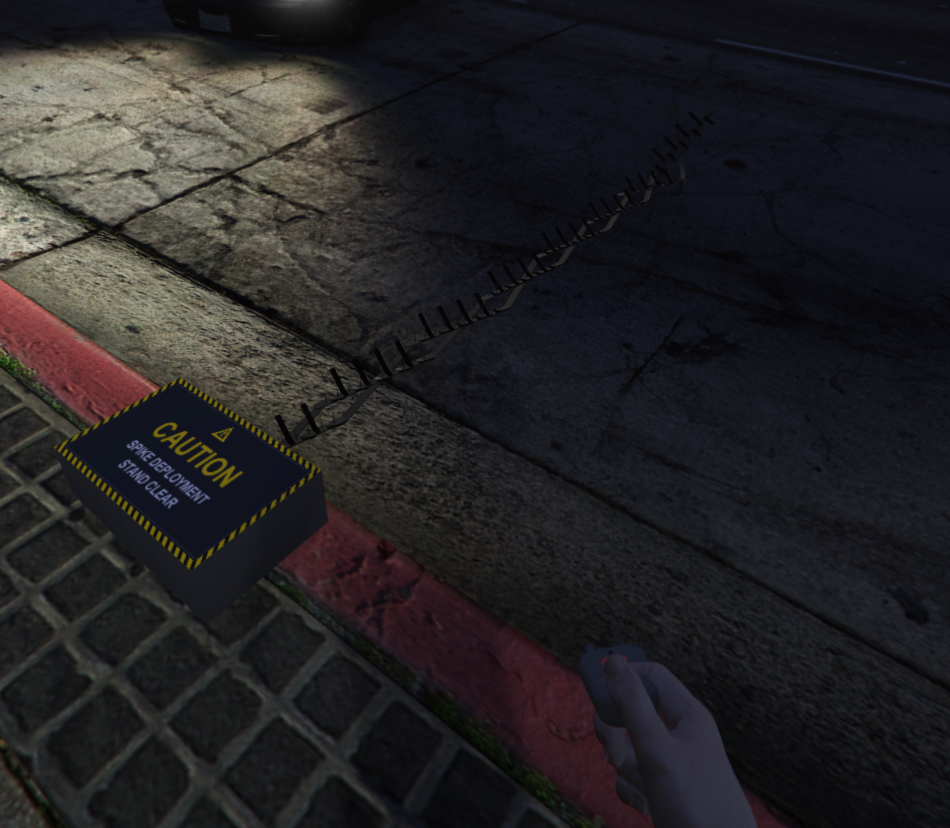

# nd_autospike

Remote spike strips for FiveM. Drop a box on the kerb, grab the fob from it, and press the button from anywhere in range. The strip rolls out of the box across the road with the stock stinger animation and sound, synced for everyone. Press again and it rolls back in.

Includes 2 custom props, spike box and key fob :)

Runs on Qbox, QBCore and ESX, or standalone with just ox_lib. Inventory through ox_inventory, qb-inventory or the ESX default.



[Full quality video](https://r2.fivemanage.com/FlrHVPZwlkMFoipHobAqB/2026-09-0322-46-07.mp4)

| | |
|---|---|
|  |  |

## Support

Discord: **https://discord.com/invite/ey2sMahZ6t**

Bugs and feature requests go in the Discord or as a GitHub issue on this repo. Tickets get answered within 12 hours.

## Requirements

- ox_lib
- oxmysql (only if you want boxes to survive restarts, on by default)
- ox_target or qb-target are optional. Without one you get a text prompt with E to pick up and G to take a fob.

## Install

1. `ensure nd_autospike` after ox_lib, oxmysql, your framework and your inventory.
2. Add the items. Only the box needs to be sold or given, fobs come out of the box.
3. Copy `images/spikebox.png` and `images/spikefob.png` into your inventory's image folder.

ox_inventory:

```lua
['spikebox'] = { label = 'Spike Box', weight = 6000, stack = false },
['spikefob'] = { label = 'Spike Fob', weight = 100, stack = false },
```

Standalone ox_inventory needs `server = { export = 'nd_autospike.useItem' }` on both. Leave it off when a framework is running.

qb-core:

```lua
spikebox = { name = 'spikebox', label = 'Spike Box', weight = 6000, type = 'item', image = 'spikebox.png', unique = true, useable = true, shouldClose = true, description = 'Remote spike strip deployer' },
spikefob = { name = 'spikefob', label = 'Spike Fob', weight = 100, type = 'item', image = 'spikefob.png', unique = true, useable = true, shouldClose = true, description = 'Links to a spike box' },
```

ESX:

```sql
INSERT INTO items (name, label, weight) VALUES ('spikebox', 'Spike Box', 6), ('spikefob', 'Spike Fob', 0);
```

Other inventories can call `exports.nd_autospike:useSpikeBox(source, slot)` and `exports.nd_autospike:useSpikeFob(source, slot, metadata)` from their own usable-item handler.

## How it plays

Use the box item, aim the ghost preview, scroll to rotate, E to confirm. The slot faces where the strip will go. Target the box for Take fob, pick up, or a manual deploy toggle. Each fob is tied to the box that issued it, so one officer can run several boxes. Picking a box up pulls its fobs back out of everyone's inventory.

Tyres go flat under 60 km/h and blow out to the rim above it. AI traffic is affected too.

## Licence

CC BY-NC-SA 4.0. Use it, change it, share it with credit and under the same licence. Don't sell it. Full text in `LICENSE`.

## Credits

- Deploy sound bank in `sounds/` is from [loaf_spikestrips](https://github.com/loaf-scripts/loaf_spikestrips) by Loaf Scripts, ISC licence included in that folder. Their tyre detection was also the starting point for the swept version used here.